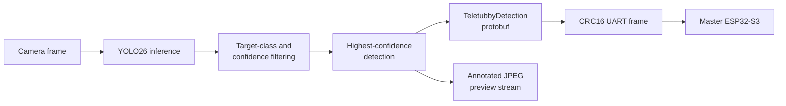

# MaixCAM Vision System

On-device object detection for Team 3's ENPH 253 autonomous robot. This
application runs a quantized YOLO26 model on a Sipeed MaixCAM, identifies the
best visible Teletubby target, and sends a typed detection message to the master
ESP32-S3 over UART.

The application also provides an annotated HTTP preview stream and persistent
runtime logs for development on the robot.

## Pipeline



For every camera frame, the application:

1. Runs YOLO26 inference.
2. Keeps detections whose labels exactly match a supported Teletubby class.
3. Selects the highest-confidence matching detection.
4. Clips its bounding box to the image dimensions.
5. Serializes the result with Protobuf.
6. Wraps the payload in the repository's checksummed UART packet format.

A no-detection message is still transmitted for frames without a valid target,
allowing the master controller to distinguish a clear frame from a stalled
camera link.

## Recognized Classes

The application recognizes these exact model labels:

| Model label | Protobuf value | Preview colour |
| --- | --- | --- |
| `Red Teletubby` | `TELETUBBY_TYPE_RED` | Red |
| `Green Teletubby` | `TELETUBBY_TYPE_GREEN` | Green |
| `Yellow Teletubby` | `TELETUBBY_TYPE_YELLOW` | Yellow |
| `Purple Teletubby` | `TELETUBBY_TYPE_PURPLE` | Purple |

## Project Structure

```text
vision/
├── main.py                  # Camera, inference, messaging, and preview loop
├── uart.py                  # Packet framing and CRC16-CCITT implementation
├── runtime_log.py           # Persistent runtime and exception logging
├── vision_pb2.py            # Generated Python protobuf bindings
├── app.yaml                 # MaixCAM application manifest
├── pyproject.toml           # Python dependencies and Poetry commands
├── poetry.lock              # Locked development dependencies
├── scripts/
│   └── compile_proto.py     # Regenerates vision_pb2.py
└── model/
    ├── yolo26n.mud          # Maix model metadata
    └── yolo26n_int8.cvimodel
```

The shared schema is located at
[`../lib/comms/proto/vision.proto`](../lib/comms/proto/vision.proto). The
receiving ESP32 task is implemented in
[`../src/master_esp/tasks/camera_uart.cpp`](../src/master_esp/tasks/camera_uart.cpp).

## Requirements

### Target

- Sipeed MaixCAM with MaixPy 4.12.5 or later in the supported 4.x series
- The bundled YOLO26 `.mud` and `.cvimodel` files
- UART connection to the master ESP32-S3

### Development machine

- Python 3.13 or later
- [Poetry](https://python-poetry.org/)
- MaixVision or equivalent MaixPy deployment tooling

## Development Setup

From the repository root:

```bash
cd vision
poetry install
```

Regenerate the Python bindings after editing `vision.proto`:

```bash
poetry run compile-proto
```

This command writes `vision/vision_pb2.py`. Because the same schema is consumed
by nanopb on the ESP32, rebuild and flash the master firmware whenever the
vision protocol changes:

```bash
cd ..
pio run -e master_esp_debug
```

## Deployment

The deployable application is described by `app.yaml`. Package or install the
`vision/` directory using MaixVision's application workflow, ensuring that both
files under `model/` are included. The application expects its model metadata at
`model/yolo26n.mud` relative to `main.py`.

On startup, the program waits eight seconds for boot networking, initializes
the model and camera, configures UART, and starts its detection loop. The camera
image is vertically flipped to match its physical mounting orientation.

## UART Protocol

The MaixCAM transmits on UART1 at **115200 baud**:

- MaixCAM TX: pin `A19`
- MaixCAM RX: pin `A18`
- Master ESP32 camera UART: UART2, RX GPIO 38, TX GPIO 39

Each multibyte framing field uses little-endian byte order:

| Field | Size | Description |
| --- | ---: | --- |
| Magic | 2 bytes | Constant `0xA55A` |
| Packet sequence | 2 bytes | Wrapping transport sequence number |
| Payload length | 2 bytes | Serialized protobuf size |
| Payload | Variable | `TeletubbyDetection` protobuf |
| CRC | 2 bytes | CRC16-CCITT over the header and payload |

The protobuf payload contains the frame sequence, image dimensions, detection
state, confidence, clipped bounding box, and Teletubby class. Transport packet
sequence numbers and camera frame sequence numbers are independent.

## Preview and Logs

The application starts a JPEG stream on port `8000`. Its resolved address is
written to the runtime log at startup:

```text
http://<maixcam-address>:8000
```

Preview annotations are generated every fourth frame to reduce overhead. The
box and label colour correspond to the detected class.

Persistent logs on the camera are written to:

```text
/root/vision_autostart.log
/root/vision_runtime.log
```

Uncaught exceptions are copied to `vision_runtime.log` and then forwarded to
MaixPy's normal exception handler.

## Tuning

| Setting | Current value | Purpose |
| --- | ---: | --- |
| `CONFIDENCE_THRESHOLD` | `0.52` | Minimum YOLO confidence accepted by inference |
| `IOU_THRESHOLD` | `0.45` | Non-maximum-suppression overlap threshold |
| `PREVIEW_INTERVAL` | `4` | Frames between preview updates |
| `JPEG_QUALITY` | `70` | Preview compression quality |

The master ESP32 performs additional validation, including image and bounding
box checks and a requirement for consecutive valid detections. Adjust both
sides deliberately if the detection contract changes.
